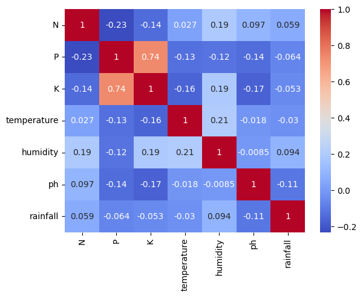
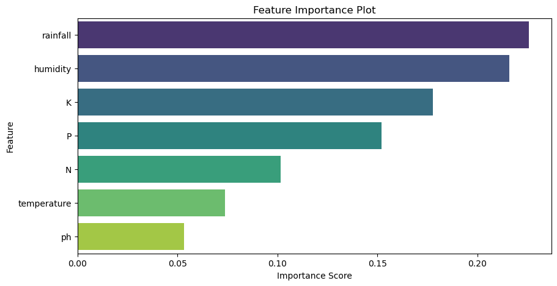
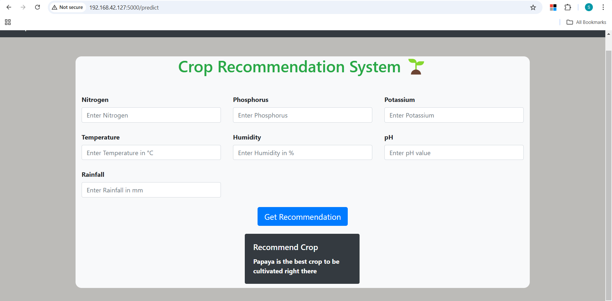

# Crops-Classification-With-Recommendation-System-Machine-Learning
# Crop Recommendation System

## 📌 Project Overview
The **Crop Recommendation System** is a machine learning-based project designed to assist farmers in selecting the most suitable crop for cultivation based on soil and weather conditions. By analyzing key environmental parameters such as **Nitrogen (N), Phosphorus (P), Potassium (K), Temperature, Humidity, pH level, and Rainfall**, this system predicts the best crop to be grown, ensuring **maximum yield and sustainability**.

## 📂 Dataset Information
The dataset used for this project includes:
- **N:** Nitrogen content in the soil (kg/ha)
- **P:** Phosphorus content in the soil (kg/ha)
- **K:** Potassium content in the soil (kg/ha)
- **Temperature:** Atmospheric temperature (°C)
- **Humidity:** Relative humidity (%)
- **pH:** pH value of the soil
- **Rainfall:** Annual rainfall (mm)
- **Label:** Recommended crop

The dataset contains **2200 samples** with 22 different crop labels.

## 🔍 Exploratory Data Analysis (EDA)
Several **visualizations** were performed to understand data distribution and relationships between features:
- **Correlation Heatmap:** Highlights relationships between soil nutrients and environmental factors.


- **Distribution Plots:** Show the spread of different features.
-1.png>)

- **Pair Plots:** Depict how features correlate with crop labels.
-1.png>)

- **Feature Importance Plot:** Identifies key parameters influencing crop selection.



## 🛠️ Model Training & Performance
The dataset was split into **training (80%)** and **testing (20%)** sets. Various classification models were tested, and their accuracy scores were recorded:

| Model | Accuracy |
|--------|---------|
| **Random Forest** | 99.3% |
| **Decision Tree** | 98.1% |
| **Logistic Regression** | 96.3% |
| **Support Vector Machine (SVM)** | 96.8% |
| **K-Nearest Neighbors (KNN)** | 95.9% |

**Random Forest was selected as the best-performing model.**

## 🚀 Installation & Setup
To run the project locally, follow these steps:

### 1️⃣ Clone the Repository
```bash
   git clone https://github.com/Sanika1422/Crop-Recommendation-System.git
   cd Crop-Recommendation-System
```

### 2️⃣ Install Dependencies
```bash
   pip install -r requirements.txt
```

### 3️⃣ Run the Flask Web App
```bash
   python app.py
```

### 4️⃣ Open the Web App
Visit **`http://192.168.42.127:5000/`** in your browser to use the Crop Recommendation System.

## 🌱 Usage & Features
### **1️⃣ Input Parameters**
Users need to enter **Nitrogen, Phosphorus, Potassium, Temperature, Humidity, pH, and Rainfall**.

### **2️⃣ Prediction System**
The system predicts the best crop based on input values and displays the recommendation.

### **3️⃣ Web Application**
A user-friendly **Flask-based web app** allows easy interaction and predictions.


 

## 📊 Results & Predictions
When a user enters the required soil and weather parameters, the model predicts the most suitable crop and provides a recommendation:

✅ **Example Input:**
```
Nitrogen: 40
Phosphorus: 50
Potassium: 50
Temperature: 30°C
Humidity: 80%
pH: 6.5
Rainfall: 200mm
```
✅ **Predicted Output:**
```
Recommended Crop: Rice 🌾
```

## 🤝 Contribution
Feel free to **fork** this repository, create a new branch, and submit a pull request with enhancements. Suggestions and improvements are always welcome!

## 📩 Contact
📌 **Sanika Meghraj Erande**  
📧 [sanika.erande14@gmail.com](mailto:sanika.erande14@gmail.com)  
🔗 **GitHub:** [Sanika1422](https://github.com/Sanika1422)

---
📌 *This project aims to support sustainable agriculture by leveraging machine learning to optimize crop selection for better yields and environmental benefits.* 🌍🌾


